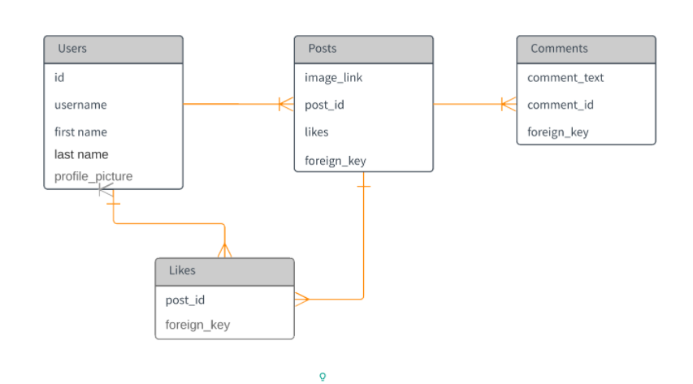
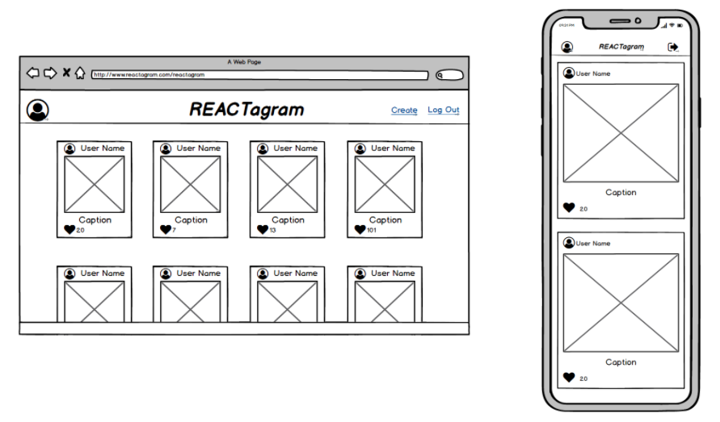
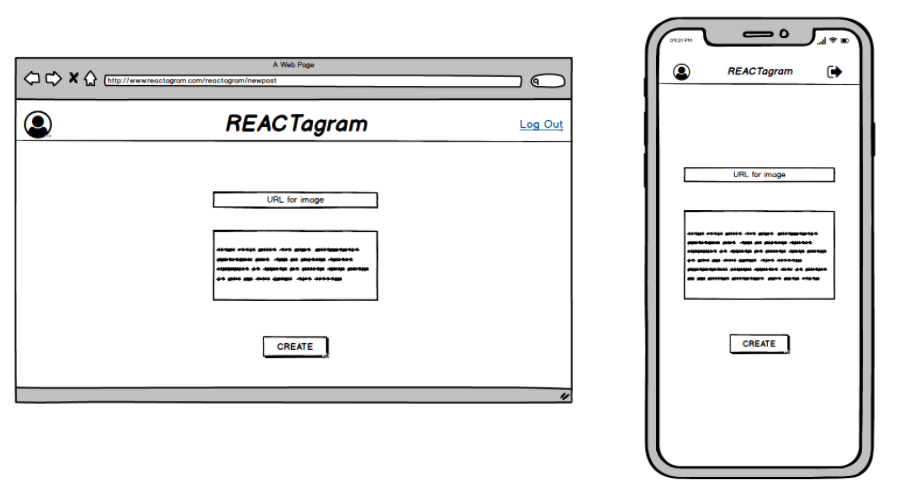
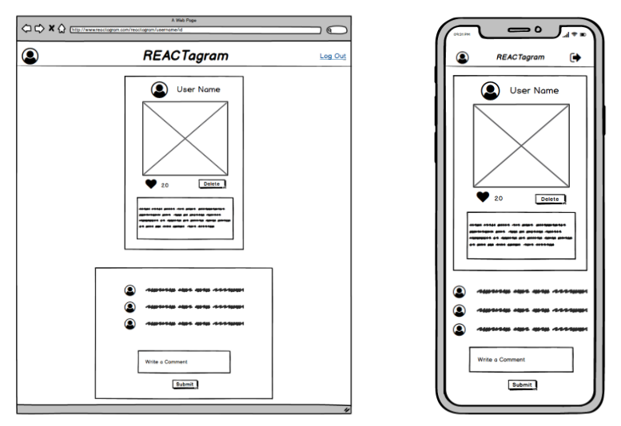

# REACTAGRAM

### A. What is the Reactagram? 

It is Instagram inspired photo and life-branding social media app. 

The app provides users the opportunity to connect with others.
Through artistic/stylized photosharing they can indulge in glamor and present their daily lives as they wish it was. 

#### User stories 

- Users can view feed(post) & comment 
- Users can delete their own posts 
- Users can create posts, which consist of a image and a caption 
- Users can comment on posts (their own or others)
- Users can toggle between liking or retracting likes from other users posts 
- When users view app on their phone or tablet they are able to scroll through a single colum of posts 
- When users view app on their desktop they are able to scroll through a card layout of posts whoes number of posts across is responsive to window size. 

### B. MVP 

##### User is able to  browse posts on their feed. (estimated timeline by EOD Saturday)

###### This requires a working: 
- express/node.js  route, model and controller x
- a seeded db, consisting of at least a posts table x
- a create-react-app  front end with react-router routes/links, and a landing page component that contains a navbar component and feed component x

##### User interact with an individual post, like  it, and comment on it, ( estimated completion EOD Monday)

###### This requires a working: 
- Comment feature  for each post
- Component x
- GET request x
- POST request x
- Styling 
- Routing x

##### User can make a post  that is then added to the global feed ( individual user profile based feeds are a reach goal).. (estimated timeline by EOD Tuesday)

###### This requires a working: 
- Route, model, and controller x
- POST request x
- Triggering a rerender of the feed upon success
- Floating icon  that triggers a form component
- Styling
- A user object in state that we pass around the application

##### User can click on any  of her created posts in the  global feed and click a delete button to delete it  (estimated timeline by EOD Wednesday)

###### This requires a working: 
- Route, model, and controller
- DELETE  request
- Checking  if the id of the post  belongs to the user by referencing the  attributes of the post and the current user object then conditionally rendering a delete button 
- Styling

### C. What features does it include? 

1. Comment feature for each post 
- Component 
- GET request 
- POST request 
- Styling 
- Routing 

2. Like features 
- Icon 
- PUT request toggling between true and false 
- Likes table 
- Styling 

### D. ERD & Wireframe 

### E. Were there ay particular pain points or unsolved problems you had to manage? (e.g. technological, timing, content, etc.)

### F. Lessons Learned

##### 1. Don't sleep on SQL
If we had been stronger at SQL instead of doing so much front-end work and having so many models we could have used sql to select, join,  data with complex specifications.

##### 2. Don't make multiple api calls for the same thing on multiple components
We now have a  better understanding of when to use state vs  when to use props. 
How important it is to learn to adapt to each other’s personalities, and maintain good communication. I feel like my team did this well.

##### 3. Adaptation to a group environment *We feel our team was really great at this!*
We learned how important it is to:
Adapt to each other’s personalities/working styles ( 60% of this project was pair coded)
Be receptive  to  feedback and  self-aware  of our  strengths & weaknesses
Maintain  good communication and offer/ask for help

### G. Lists of the technologies used 

- JavaScript 
- React.js
- React Router 
- Psql
- Axios 
- Express 
- Flexbox 

### Website address for the REACTAGRAM 
